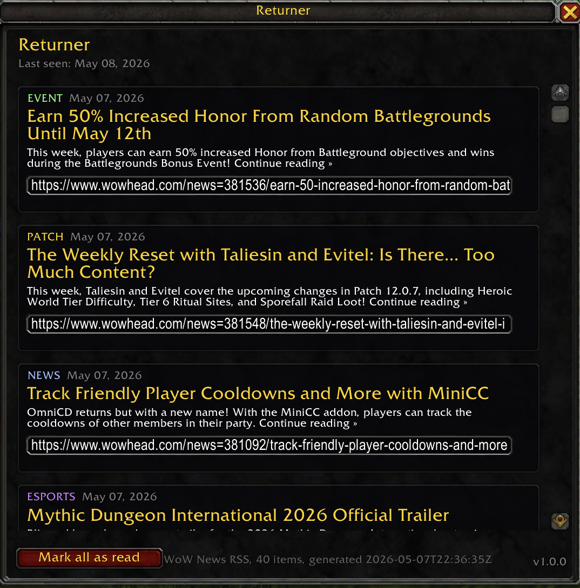

# Returner

[](LICENSE)
[]()
[]()
[](.github/workflows/auto-update.yml)

A welcome-back panel for World of Warcraft. When you log in after being away, Returner shows you what you missed since your last session : patches, events, hotfixes, and ongoing in-game happenings. Auto-updated daily via a GitHub Action that scrapes the WoW news feed.

<p align="center">
  
</p>

## Features

- **Auto-popup on return** after a configurable absence (default : 7 days)
- **40+ news items** color-coded by category : `PATCH`, `EVENT`, `HOTFIX`, `NEWS`, `ESPORTS`
- **Per-account tracking** : alts don't get spammed once you've caught up
- **Auto-updated content** : a daily GitHub Action regenerates `Data.lua` and ships a release
- **Lightweight** : pure Lua, no library dependencies, ~12 kB on disk
- **Hackable** : the data is a plain Lua table, fork it and add your own items

## Installation

### Via CurseForge App (recommended)

Search for **Returner** and click Install. Updates land automatically every time the bot scrapes a fresh news cycle.

### Manual

1. Download the latest release zip from [Releases](../../releases)
2. Extract the `Returner/` folder into `World of Warcraft/_retail_/Interface/AddOns/`
3. Restart the game (or `/reload`)

## Commands

| Command | Description |
|---|---|
| `/rt` or `/returner` | Open the panel anytime |
| `/rt threshold <N>` | Days of absence before auto-popup. `0` disables, `/rt` still works manually |
| `/rt on` / `/rt off` | Toggle auto-popup without losing the threshold setting |
| `/rt reset` | Clear read state. Next open shows all items |
| `/rt status` | Print current settings, threshold, last-seen, seen-until |
| `/rt simulate <N>` | Preview the panel as if you'd been away N days. Pure testing tool |

## How it works

1. On every login, Returner records your timestamp
2. On the next login, it computes the gap and compares to your threshold
3. If the gap is large enough **and** there are unread items, the panel opens
4. You scroll, read, click *Mark all as read*
5. Behind the scenes, a GitHub Action refreshes the news data daily so the addon stays current

## Architecture

```
WoW News RSS  →  GitHub Action (cron at 06:00 UTC)
                          ↓
                   Python scraper / parser
                          ↓
                  Data.lua regenerated
                          ↓
                  Tag pushed if changed
                          ↓
                  BigWigsMods packager
                          ↓
                  CurseForge auto-publish
                          ↓
                  Players auto-update overnight
```

## Project structure

```
Returner/
├── Returner.toc                    # addon metadata (Interface 120005)
├── Returner.lua                    # tracking + panel UI + slash commands
├── Data.lua                        # auto-generated news items
├── LICENSE                         # MIT
├── README.md                       # this file
├── CHANGELOG.md                    # version history
├── .pkgmeta                        # BigWigsMods packager config
├── scripts/
│   └── update_news.py              # daily scraper, regenerates Data.lua
├── screenshots/
│   └── panel.png                   # in-game preview
└── .github/workflows/
    ├── auto-update.yml             # daily cron, scrapes news, tags release
    └── release.yml                 # on tag, packages and publishes to CurseForge
```

## Manual data update (without GitHub)

If you want to regenerate `Data.lua` locally :

```bash
pip install feedparser
python3 scripts/update_news.py
```

Requires Python 3.9+.

## License

MIT. Fork it, mod it, ship your own variant.

## Author

**AxelRodd** · still chasing the perfect corner hit
